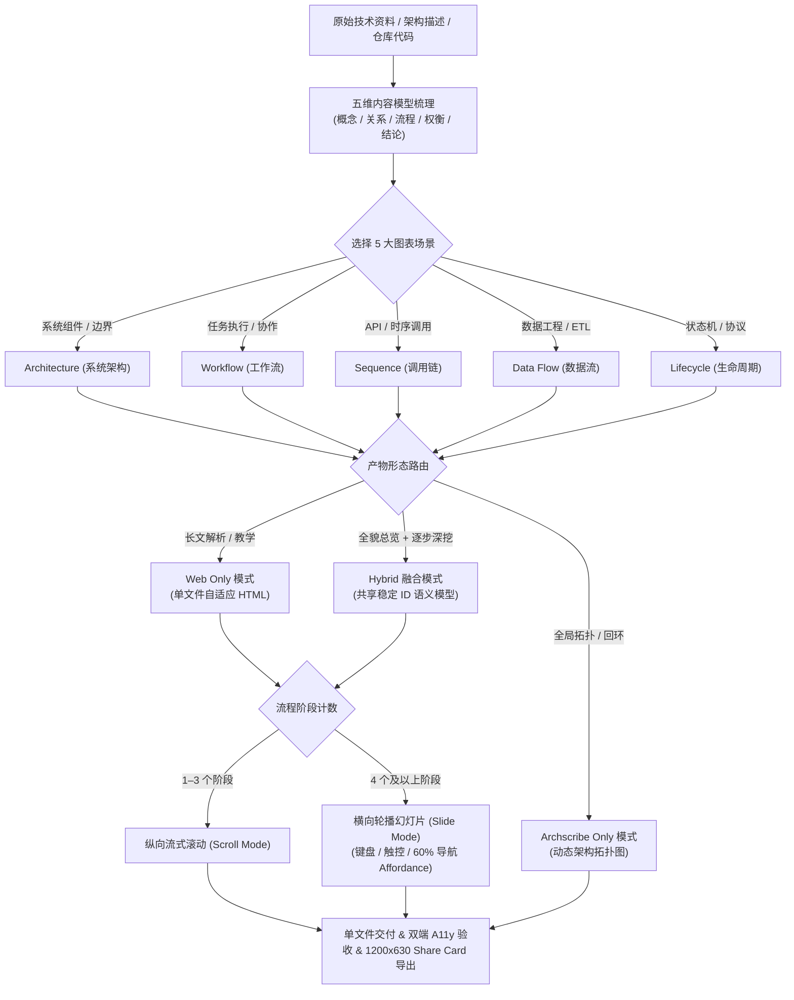

# HCH Architecture Explainers (技术架构 Web 可视化与解释器系统)

> 基于 **HCH.HUB 2.0** 视觉设计语言与 **[tt-a1i/archify](https://github.com/tt-a1i/archify)** 最佳实践，将复杂的技术栈、系统架构、数据流转与算法流程转化为高互动、高品质、自适应的 **单文件 Web 解释器 (Web Explainer)** 与 **动态架构拓扑图 (Archscribe Diagram)**。

---

## 目录

- [1. 项目愿景与设计哲学](#1-项目愿景与设计哲学)
- [2. 五大标准图表与解释器场景 (5 Diagram Types)](#2-五大标准图表与解释器场景-5-diagram-types)
- [3. 核心方法论与决策链](#3-核心方法论与决策链)
  - [五维内容模型 (Content Model)](#五维内容模型-content-model)
  - [自适应流程交互策略 (Flow Strategy)](#自适应流程交互策略-flow-strategy)
  - [产物形态路由 (Artifact Routing)](#产物形态路由-artifact-routing)
- [4. 进阶交互与视觉体系](#4-进阶交互与视觉体系)
  - [深度探查与故事回放 (Route Probe & Reach)](#深度探查与故事回放-route-probe--reach)
  - [四套视觉风格预设 (Visual Presets)](#四套视觉风格预设-visual-presets)
  - [深浅双主题设计令牌 (Dark / Light Theme)](#深浅双主题设计令牌-dark--light-theme)
  - [标准 1200×630 分享卡片规范 (Share Cards)](#标准-1200630-分享卡片规范-share-cards)
- [5. 项目工程结构全景](#5-项目工程结构全景)
- [6. 核心子模块详解](#6-核心子模块详解)
  - [6.1 Codex / Agent Skill 体系](#61-codex--agent-skill-体系)
  - [6.2 单文件标杆作品：Skill Lifecycle](#62-单文件标杆作品skill-lifecycle)
  - [6.3 Archscribe 动态架构图引擎 PoC](#63-archscribe-动态架构图引擎-poc)
  - [6.4 现代交互式 Web 演示台 (Web Demo)](#64-现代交互式-web-演示台-web-demo)
- [7. 快速上手与多 Agent 安装](#7-快速上手与多-agent-安装)
- [8. 自动化测试与质量验收](#8-自动化测试与质量验收)
- [9. 相关规范与参考文档](#9-相关规范与参考文档)

---

## 1. 项目愿景与设计哲学

在现代软件工程与 AI Agent 架构演进中，传统的静态架构图与长篇文字文档存在以下痛点：
- **时序与流向丢失**：难以表达请求在复杂微服务间的流转、重试、熔断与失败回环；
- **跨角色对齐困难**：业务方、架构师与开发人员对系统边界与数据流转的抽象理解容易脱节；
- **排版与交互体验沉闷**：缺乏引导性的探索工具与交互式状态演进。

**`hch-architecture-explainers`** 结合 **tt-a1i/archify** 的 Agent 技能化思路，提供了一整套从**内容建模**、**场景选型**、**交互设计**、**进阶探查**到**自动化质量验收**的标准化规范与 Agent Skill 资产库。



---

## 2. 五大标准图表与解释器场景 (5 Diagram Types)

系统将常见技术展示梳理为 5 大标准技术图表模式，每种模式均具备清晰的提问清单与呈现重点：

| 图表类型 (Type) | 最佳适用场景 | 关键呈现要素 | 推荐 Prompt 示例 |
| :--- | :--- | :--- | :--- |
| **1. Architecture (系统架构)** | 微服务拓扑、网关路由、多云基础设施、系统物理与逻辑边界 | 服务边界、传输协议、持久存储、负载均衡、外部依赖与信任隔离域 | `分析这个仓库，画出核心运行时架构图，只保留 8–12 个核心组件并标出信任边界。` |
| **2. Workflow (工作流 / 协作)** | CI/CD 流水线、Agent 任务执行链路、人工审批流、故障应急 Runbook | 参与角色、判断分支、工具调用、失败回退回路与质量检查网关 | `画出 Agent 从接收用户 Prompt、匹配 Skill 到调用工具并验证结果的工作流。` |
| **3. Sequence (时序 / 调用链)** | API 请求全链路、缓存命中/回源、分布式鉴权、异步事件解耦 | 调用方与被调用方、请求响应时序、异步解耦点、超时降级处理 | `画出这条登录流程：Browser -> Gateway -> JWT 校验 -> Redis 命中 / DB 回源。` |
| **4. Data Flow (数据流转 / 工程)** | 大数据数仓 ETL/ELT、实时计算、数据血缘拓扑、敏感数据 PII 隔离 | 数据源、转换算子、分层存储 (ODS/DWD/DWS/ADS)、下游消费端 | `展示多源数据经 Kafka 汇入 ODS，再由 Spark 清洗为 DWD/DWS 并供 BI 消费的数据流。` |
| **5. Lifecycle (生命周期 / 状态机)** | Agent Skill 发现加载、订单事务状态机、资源生命周期管理 | 触发条件、状态迁移矩阵、按需资源展开、质量门槛与终态 | `展示 Skill 的完整生命周期：宿主暴露目录、语义匹配、主说明加载、工具执行与验证闭环。` |

---

## 3. 核心方法论与决策链

### 五维内容模型 (Content Model)
在设计页面前，先将技术资料映射到五个标准化维度：
1. **概念 (Concept)**：系统/机制是什么、解决什么核心问题、边界在哪里；
2. **关系 (Relationship)**：各组件、工具与协议如何分工协作与连接；
3. **流程 (Flow)**：输入如何经过各个阶段转化为输出与状态变化；
4. **权衡 (Tradeoff)**：为什么选择此方案、适用理由与关键代价；
5. **结论 (Conclusion)**：用户应当记住的设计原则与下一步行动。

### 自适应流程交互策略 (Flow Strategy)
- **1–3 个独立节点**：采用**纵向滚动 (Scroll Mode)**，节点按自然阅读顺序依次进入视口；
- **4 个及以上独立节点**：采用**横向 Slide 模式 (Slide Mode)**，一次聚焦一个完整阶段：
  - 右下角配备常态 **60% 透明度**、悬停/聚焦 **100% 透明度** 的控制器；
  - 完整支持：上一页/下一页、`01 / 12` 动态页码、键盘左右方向键、移动端触控滑动（Touch Swipe）；
  - 首尾边界具有严格的禁用（`disabled`）状态与无障碍（`aria-live`）提示。

### 产物形态路由 (Artifact Routing)
- **Web only**：重点是概念、比较、长文解释或逐步教学；
- **Archscribe only**：重点是全局拓扑、分支、回环、演示动画或可编辑交付；
- **Hybrid (融合模式)**：共享统一语义内容模型，Archscribe 提供全局闭环总览，Web 提供分步深度剖析。

---

## 4. 进阶交互与视觉体系

### 深度探查与故事回放 (Route Probe & Reach)
借鉴 **tt-a1i/archify** 的高级架构探查能力：
1. **Route Probe (路径探查)**：支持点击或选择特定业务路径（如 `Order Flow`、`Payment Flow`），一键高亮最短有向路径，其余无关节点自动半透明虚化；
2. **Reach Analysis (可达性分析)**：点击任意节点即可计算并高亮其 **Upstream (上游依赖)** 与 **Downstream (下游影响)**，避免凭空捏造链路；
3. **Story / Chapter Play (章节故事播放)**：内置多场景（正常主干流 vs 异常降级流）的逐步播放控制；
4. **Architecture Diff (演进对比)**：支持 Before（原有架构）、Delta（变更增删改）、After（演进后目标）三态对比。

### 四套视觉风格预设 (Visual Presets)
- **Cyber / HCH (默认)**：深海军蓝 `#05091A`、高亮青 `#00CFFF` 与冷白文字，沉浸式科技感；
- **Signal Flow (信号流 / 管道)**：强化粒子流动与管道流向，适合数据工程与调用链路；
- **Blueprint (工程蓝图)**：蓝图工程网格底纹与等宽字体标记，适合多区域基础设施与物理拓扑；
- **Classic (经典极简)**：高对比黑白灰线条，适合正式技术评审、PDF 导出与打印报告。

### 深浅双主题设计令牌 (Dark / Light Theme)
| 令牌 | 深色主题 (Dark - 默认) | 浅色主题 (Light) | 职责说明 |
| :--- | :--- | :--- | :--- |
| `--bg` | `#05091A` | `#F8FAFC` | 基底背景画布 |
| `--ink` | `#E2EEFF` | `#0F172A` | 高对比度主正文与标题 |
| `--cyan` | `#00CFFF` | `#0284C7` | 主强调色、交互高亮与连接流向 |
| `--green` | `#00FF8A` | `#16A34A` | 成功态、健康流向与验收通过标志 |
| `--orange` | `#FF7C5C` | `#EA580C` | 风险警示、故障回路与关键设计权衡 |

### 标准 1200×630 分享卡片规范 (Share Cards)
支持生成 **1200×630 px** 黄金比例图片，完美适配 GitHub README、社交分享与 Release 发布：
- **Canonical Share Card**：全景系统拓扑与核心指标卡；
- **Route Share Card**：高亮特定关键调用链，保留完整背景拓扑作为上下文；
- **Reach Share Card**：某一核心服务的影响范围与依赖拓扑卡。

---

## 5. 项目工程结构全景

```text
/home/hch-architecture-explainers/
├── README.md                               # 项目主文档与全局技术指南
├── LICENSE                                 # 开源许可证 (MIT)
│
├── skill-lifecycle.html                    # [核心成果] 单文件 Web 解释器标杆：《Skill 生命周期》
├── validate-skill-lifecycle.mjs            # [验收测试] skill-lifecycle.html 视觉契约与逻辑断言
│
├── skills/
│   └── creating-architecture-web-explainers/   # [Skill 核心] Codex / Agentic Skill 资产包
│       ├── SKILL.md                            # Skill 核心规则、触发条件、5 大图表类型与进阶交互
│       ├── agents/
│       │   └── openai.yaml                     # Skill 界面配置与默认 Prompt
│       ├── references/
│       │   ├── content-model.md                # 五维内容模型与 5 大图表场景选型提问清单 (Recipes)
│       │   ├── visual-system.md                # HCH.HUB 2.0 视觉令牌、4 套预设与 1200x630 分享卡规范
│       │   └── archscribe-integration.md       # Archscribe 与 Web 融合指南、JSON IR 与 Diff 规范
│       ├── assets/
│       │   └── explainer-starter.html          # 自适应单文件 Web 解释器通用起始模板
│       └── scripts/
│           ├── validate-explainer.mjs          # 单文件 HTML 契约与运行时验证器
│           └── validate-skill.mjs              # Skill 规则与引用完整性校验
│
├── archscribe-poc/                         # [架构图引擎] 动态拓扑图 PoC 与渲染管线
│   ├── README.md                           # Archscribe PoC 使用与渲染指南
│   ├── skill-runtime-spec.json             # 节点、边、动画与回环声明规范
│   ├── hybrid-map.json                     # 图节点与 Web 步骤稳定 ID 映射表
│   ├── engine/
│   │   └── scripts/
│   │       ├── graph_model.py              # 架构图几何布局与路径规划器
│   │       └── render_animated_diagram.py  # Pillow / Chromium 多后端渲染入口
│   └── outputs/                            # 渲染输出产物 (PNG / GIF / Excalidraw)
│       ├── skill-runtime.png
│       ├── skill-runtime.gif
│       └── skill-runtime.excalidraw
│
├── web-demo/                               # [演示平台] React + Vite + Tailwind 多场景演练台
│   ├── package.json                        # 项目依赖与运行脚本
│   ├── vite.config.ts                      # Vite 配置文件
│   ├── index.html                          # 演示台 HTML 容器
│   ├── src/
│   │   ├── App.tsx                         # 导航栏与主视图切换
│   │   ├── main.tsx                        # React 入口文件
│   │   ├── index.css                       # 全局样式与 Tailwind CSS 引入
│   │   └── pages/
│   │       ├── Home.tsx                    # 首页：粒子图动画与价值矩阵
│   │       ├── Pathfinding.tsx             # 基础算法：Dijkstra / A* 寻路探索可视化
│   │       ├── DataFlow.tsx                # 系统构架：微服务调用链、Route Probe 与 Reach 分析
│   │       └── DataWarehouse.tsx           # 数据工程：数仓分层 (ODS/DWD/DWS/ADS) 入湖全景
│   ├── AGENTS.md                           # 演示台 Agent 开发指引
│   └── CLAUDE.md                           # 演示台快捷指引
│
└── docs/                                   # [设计与测试文档]
    └── superpowers/
        ├── specs/
        │   └── 2026-08-19-architecture-web-explainer-skill-design.md # Skill 完整设计规格
        ├── plans/
        │   └── 2026-08-19-architecture-web-explainer-skill.md        # 逐步实施与验证计划
        └── skill-tests/
            ├── architecture-web-explainer-baseline.md                # 无 Skill 基线审查
            └── architecture-web-explainer-with-skill.md              # 引入 Skill 后的对照评估
```

---

## 6. 核心子模块详解

### 6.1 Codex / Agent Skill 体系
路径：[`skills/creating-architecture-web-explainers/`](file:///home/hch-architecture-explainers/skills/creating-architecture-web-explainers/)

- **`SKILL.md`**：定义了 Agent 在遇到架构可视化任务时的决策闭环，包含 5 种标准图表场景、五类内容模型梳理、产物形态判断、节点阈值决策与双端验收要求；
- **`assets/explainer-starter.html`**：一个开箱即用的自适应极简起始模板，内置 `globalThis.selectFlowMode(stepCount)` 纯函数与控制器。步骤数 $\le 3$ 时自动切换为滚动流；步骤数 $\ge 4$ 时自动激活 Slide 幻灯片与键盘/触控响应；
- **`scripts/validate-explainer.mjs`**：通过 Node.js `vm` 沙箱深度执行模板内置 JavaScript 状态机，严格断言单文件无外链、HCH 令牌完备性、无障碍标签与手势交互。

### 6.2 单文件标杆作品：Skill Lifecycle
路径：[`skill-lifecycle.html`](file:///home/hch-architecture-explainers/skill-lifecycle.html)

展示了 Agent 如何发现、选择、按需加载、执行、观察与闭环验证能力的完整技术全景，页面分为四大区域：
1. **Hero 概览区**：阐释 Skill 核心定义公式（`触发条件 + 专业流程 + 按需资源`），配备动态轨道与 `SKILL.md` 浮动代码卡；
2. **Positioning 定位与对比区**：横向对比 `Prompt`、`Skill`、`Tool / MCP` 与 `Agent Loop` 四大运行时概念，剖析适合理由与能力边界；
3. **Mechanism 机制展示区**：通过 **12 阶段精细 Slide**，分步讲解从宿主暴露能力目录、显式/隐式选择、主说明解析、按需展开资源、调用工具、观察结果到质量闸门闭环；
4. **Outro 结语与设计启示**：总结渐进式披露（Progressive Disclosure）与 Agent 上下文控制的最佳实践。

### 6.3 Archscribe 动态架构图引擎 PoC
路径：[`archscribe-poc/`](file:///home/hch-architecture-explainers/archscribe-poc/)

- **`skill-runtime-spec.json`** 声明了从 `task`（任务进入）、`select`（选择）、`load`（加载）、`act`（执行）、`observe`（观察）到 `verify`（验证）的拓扑节点与 `kind: "loop"` 回环边；
- **`hybrid-map.json`** 建立了图节点与 Web 12 个 Slide 之间的双向映射，确保 Hybrid 模式下“图与网页术语一致、阶段统一”。

### 6.4 现代交互式 Web 演示台 (Web Demo)
路径：[`web-demo/`](file:///home/hch-architecture-explainers/web-demo/)

- **微服务数据流转 (DataFlow)**：已集成 **Route Probe**（订单流、支付流、会话流路径探查）与 **Reach Analysis**（点击节点查看上游与下游影响域），支持 `Cyber / Signal / Blueprint` 风格预设；
- **寻路算法 (Pathfinding)**：对比 Dijkstra 与 A* 算法的搜索前沿扩展、障碍物避让与最短路径生成；
- **数据工程入湖 (DataWarehouse)**：全景式呈现经典大数据数仓架构（Source $\to$ Ingestion $\to$ ODS $\to$ DWD $\to$ DWS $\to$ ADS）。

---

## 7. 快速上手与多 Agent 安装

### 全局安装 Skill (参考 tt-a1i/archify 规范)
```bash
# 全局安装 Skill
npx skills add tt-a1i/archify -g

# 显式安装到 Cursor
npx -y skills add tt-a1i/archify --skill archify --agent cursor --global --copy --yes

# 临时在当前会话中体验
npx skills use tt-a1i/archify@archify --agent codex
```

### 查看单文件 Web 解释器
直接在任意现代浏览器中打开目标 HTML 文件即可，完全零外部依赖：
- 打开标杆案例：[`skill-lifecycle.html`](file:///home/hch-architecture-explainers/skill-lifecycle.html)
- 打开空白模板：[`skills/creating-architecture-web-explainers/assets/explainer-starter.html`](file:///home/hch-architecture-explainers/skills/creating-architecture-web-explainers/assets/explainer-starter.html)

### 运行 Archscribe Python 渲染
```bash
cd archscribe-poc

# 执行生成 PNG / GIF / Excalidraw
python engine/scripts/render_animated_diagram.py \
  --spec skill-runtime-spec.json \
  --outdir outputs \
  --basename skill-runtime \
  --renderer pillow \
  --formats png,gif,excalidraw \
  --verify --check
```

---

## 8. 自动化测试与质量验收

项目配备了自动化测试工具链，全面保障页面契约、脚本语法、状态机与 Skill 规则的完整性：

```bash
# 1. 验证标杆页面 skill-lifecycle.html 的视觉与交互契约
node validate-skill-lifecycle.mjs

# 2. 验证起始模板 explainer-starter.html 的沙箱状态机、无障碍与单文件约束
node skills/creating-architecture-web-explainers/scripts/validate-explainer.mjs

# 3. 验证 Skill 规则完整性与 Archscribe 集成契约
node skills/creating-architecture-web-explainers/scripts/validate-skill.mjs
```

---

## 9. 相关规范与参考文档

- [技术架构 Web 可视化 Skill 规格设计书](file:///home/hch-architecture-explainers/docs/superpowers/specs/2026-08-19-architecture-web-explainer-skill-design.md)
- [实施与逐步验收计划 (Implementation Plan)](file:///home/hch-architecture-explainers/docs/superpowers/plans/2026-08-19-architecture-web-explainer-skill.md)
- [无 Skill 独立基线测试报告](file:///home/hch-architecture-explainers/docs/superpowers/skill-tests/architecture-web-explainer-baseline.md)
- [引入 Skill 后的 5 项能力对照评估报告](file:///home/hch-architecture-explainers/docs/superpowers/skill-tests/architecture-web-explainer-with-skill.md)
- [Archscribe PoC 详细说明](file:///home/hch-architecture-explainers/archscribe-poc/README.md)
- [tt-a1i / Archify 官方仓库](https://github.com/tt-a1i/archify)

---

## License

本项目基于 [MIT License](file:///home/hch-architecture-explainers/LICENSE) 开源。
